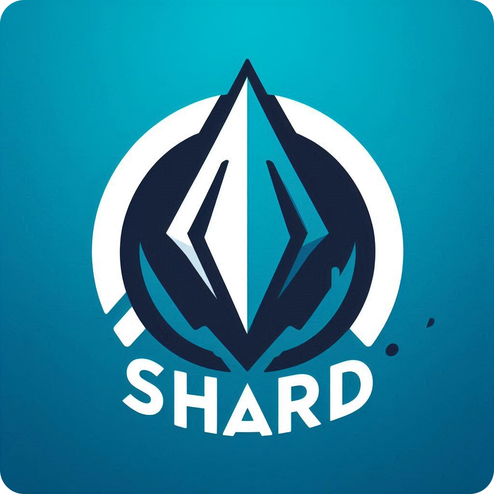

<a id="readme-top"></a>
<!-- PROJECT SHIELDS -->
<!--
*** I'm using markdown "reference style" links for readability.
*** Reference links are enclosed in brackets [ ] instead of parentheses ( ).
*** See the bottom of this document for the declaration of the reference variables
*** for contributors-url, forks-url, etc. This is an optional, concise syntax you may use.
*** https://www.markdownguide.org/basic-syntax/#reference-style-links
-->
[![Contributors][contributors-shield]][contributors-url]
[![Forks][forks-shield]][forks-url]
[![Stargazers][stars-shield]][stars-url]
[![Issues][issues-shield]][issues-url]
[![MIT License][license-shield]][license-url]


<!-- PROJECT LOGO -->
<br />
<div align="center">
  <a href="https://github.com/Pokeylooted/Shard">
    
  </a>

<h3 align="center">Shard</h3>

  <p align="center">
    A foss fullstack service for clipping your games
    <br />
    <a href="https://github.com/Pokeylooted/Shard"><strong>Explore the docs »</strong></a>
    <br />
    <br />
    <a href="https://github.com/Pokeylooted/Shard">View Demo</a>
    ·
    <a href="https://github.com/Pokeylooted/Shard/issues/new?labels=bug&template=bug-report---.md">Report Bug</a>
    ·
    <a href="https://github.com/Pokeylooted/Shard/issues/new?labels=enhancement&template=feature-request---.md">Request Feature</a>
  </p>
</div>


<!-- TABLE OF CONTENTS -->
<details>
  <summary>Table of Contents</summary>
  <ol>
    <li>
      <a href="#about-the-project">About The Project</a>
      <ul>
        <li><a href="#built-with">Built With</a></li>
      </ul>
    </li>
    <li>
      <a href="#getting-started">Getting Started</a>
      <ul>
        <li><a href="#prerequisites">Prerequisites</a></li>
        <li><a href="#installation">Installation</a></li>
      </ul>
    </li>
    <li><a href="#usage">Usage</a></li>
    <li><a href="#roadmap">Roadmap</a></li>
    <li><a href="#contributing">Contributing</a></li>
    <li><a href="#license">License</a></li>
    <li><a href="#contact">Contact</a></li>
    <li><a href="#acknowledgments">Acknowledgments</a></li>
  </ol>
</details>


<!-- ABOUT THE PROJECT -->
## About The Project

[![Product Name Screen Shot][product-screenshot]](https://github.com/Pokeylooted/Shard)

Shard is a project ment to replace other clipping softwares, for a fully opensource alternative.  
<p align="right">(<a href="#readme-top">back to top</a>)</p>

### Built With

- ⚡ [**FastAPI**](https://fastapi.tiangolo.com) for the Python backend API.
    - 🧰 [SQLModel](https://sqlmodel.tiangolo.com) for the Python SQL database interactions (ORM).
    - 🔍 [Pydantic](https://docs.pydantic.dev), used by FastAPI, for the data validation and settings management.
    - 💾 [PostgreSQL](https://www.postgresql.org) as the SQL database.
- 🚀 [React](https://react.dev) for the frontend.
    - 💃 Using TypeScript, hooks, Vite, and other parts of a modern frontend stack.
    - 🎨 [Chakra UI](https://chakra-ui.com) for the frontend components.
    - 🤖 An automatically generated frontend client.
    - 🧪 [Playwright](https://playwright.dev) for End-to-End testing.
    - 🦇 Dark mode support.
- 🐋 [Docker Compose](https://www.docker.com) for development and production.
- 🔒 Secure password hashing by default.
- 🔑 JWT (JSON Web Token) authentication.
- 📫 Email based password recovery.
- ✅ Tests with [Pytest](https://pytest.org).
- 📞 [Traefik](https://traefik.io) as a reverse proxy / load balancer.
- 🚢 Deployment instructions using Docker Compose, including how to set up a frontend Traefik proxy to handle automatic HTTPS certificates.
- 🏭 CI (continuous integration) and CD (continuous deployment) based on GitHub Actions.

<p align="right">(<a href="#readme-top">back to top</a>)</p>


<!-- GETTING STARTED -->
## Getting Started

To get a local copy up and running follow these simple example steps.

### Prerequisites

* flask
  ```sh
  pip install flask
  ```

### Installation


1. Clone the repo
   ```sh
   git clone https://github.com/Pokeylooted/Shard.git
   ```
2. Install requirements using setuptools
   ```sh
   pip install .
   ```

<p align="right">(<a href="#readme-top">back to top</a>)</p>


<!-- USAGE EXAMPLES -->
## Usage

Todo: Add usage

_For more examples, please refer to the [Documentation](https://github.com/Pokeylooted/Shard)_

<p align="right">(<a href="#readme-top">back to top</a>)</p>


<!-- ROADMAP -->
## Roadmap

- [ ] Finish Readme
- [ ] Contributer Guide
- [ ] Initial Release
    - [ ] Setup framework

See the [open issues](https://github.com/Pokeylooted/Shard/issues) for a full list of proposed features (and known issues).

<p align="right">(<a href="#readme-top">back to top</a>)</p>


<!-- CONTRIBUTING -->
## Contributing

Contributions are what make the open source community such an amazing place to learn, inspire, and create. Any contributions you make are **greatly appreciated**.

If you have a suggestion that would make this better, please fork the repo and create a pull request. You can also simply open an issue with the tag "enhancement".
Don't forget to give the project a star! Thanks again!

1. Fork the Project
2. Create your Feature Branch (`git checkout -b feature/AmazingFeature`)
3. Commit your Changes (`git commit -m 'Add some AmazingFeature'`)
4. Push to the Branch (`git push origin feature/AmazingFeature`)
5. Open a Pull Request

<p align="right">(<a href="#readme-top">back to top</a>)</p>


<!-- LICENSE -->
## License

Distributed under the GNU License. See `LICENSE.txt` for more information.

<p align="right">(<a href="#readme-top">back to top</a>)</p>


<!-- CONTACT -->
## Contact

Your Name - [@Pokeylooted](https://twitter.com/Pokeylooted) - contact@exorbgn.net

Project Link: [https://github.com/Pokeylooted/Shard](https://github.com/Pokeylooted/Shard)

<p align="right">(<a href="#readme-top">back to top</a>)</p>


<!-- ACKNOWLEDGMENTS -->
## Acknowledgments

* [@xXEpicGamerXx](https://github.com/xXEpicGamerXx)
* [@tiangolo](https://github.com/tiangolo)

<p align="right">(<a href="#readme-top">back to top</a>)</p>


<!-- MARKDOWN LINKS & IMAGES -->
<!-- https://www.markdownguide.org/basic-syntax/#reference-style-links -->
[contributors-shield]: https://img.shields.io/github/contributors/Pokeylooted/Shard.svg?style=for-the-badge
[contributors-url]: https://github.com/Pokeylooted/Shard/graphs/contributors
[forks-shield]: https://img.shields.io/github/forks/Pokeylooted/Shard.svg?style=for-the-badge
[forks-url]: https://github.com/Pokeylooted/Shard/network/members
[stars-shield]: https://img.shields.io/github/stars/Pokeylooted/Shard.svg?style=for-the-badge
[stars-url]: https://github.com/Pokeylooted/Shard/stargazers
[issues-shield]: https://img.shields.io/github/issues/Pokeylooted/Shard.svg?style=for-the-badge
[issues-url]: https://github.com/Pokeylooted/Shard/issues
[license-shield]: https://img.shields.io/github/license/Pokeylooted/Shard.svg?style=for-the-badge
[license-url]: https://github.com/Pokeylooted/Shard/blob/main/LICENSE
[product-screenshot]: images/screenshot.png